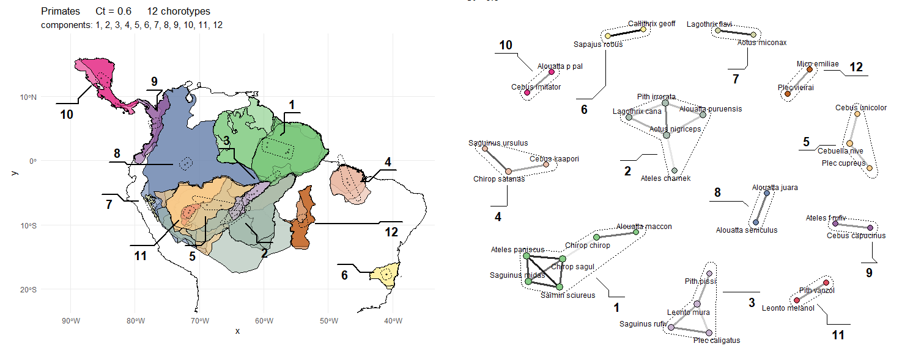

<div>
  
   </div>

```r 
SCAN -> Biogeographical Units (Chorotypes) based on a Network Analysis of Spatial Congruences 
```
# This is SCAN V 2 # 

<table>
  <tr>
    <td>
      ## WARNING!!! ##
SCAN V2 is not ready yet... I am migrating old tools and incoroporating new ones, such as an improved Cs calcultion using parallel multi core calculation...

    </td>
  </tr>
</table>


Spatial analysis to its essence in an extremely simple theoretical and conceptual background. No fancy models, statistics, or simulations, at least by now. Just a fine adjustment of direct and indirect Spatial Congruences (Cs) between species to find Chorotypes, or communities in Graph terminology. Yes, spatial patterns can be seem as direct network relationships.

### What is SCAN about?
In **Biogeography**, the field of biology that studies the spatial distribution of species and the evolution of their environments, a pervasive question remains: why do unrelated species often exhibit similar geographic distributions? The phenomenon of distributional congruence inspired Wallace — the father of Biogeography and co-founder of the Theory of Evolution by Natural Selection — as well as many subsequent researchers, to develop insights about the evolution and ecology of species and environments. Ideally, congruence should be among the primary criteria for any biogeographic analysis based on species distributions. Unfortunately, until now, most methods have not employed spatial congruence between distributions as an explicit and controllable parameter.
 
 <table>
  <tr>
  <td>
    
  </td>
  <td>
    Psophia leucoptera <i>shares its distribution with other birds at the Inambari Endemic Area, SW Amazonia</i>
  </td>
  </tr>
</table>

What about using congruence between species as the primary informative criterion? Such pairwise Network Relationships could allow the detection of: 1) groups of species sharing distributions, but also potentially (2) overlapping but independent spatial patterns, while yet simultaneously describing (3) gradients fo species distributions. SCAN does that! It addresses three analytical requirements not previously combined in any method, representing a significant advance in the biogeographical analysis of species distributions.

<table>
  <tr>
  <td>
    
  </td>
  <td>
    <i>Examples of Primate Chorotypes across South and Central Americas at a Spatial Congruence Cs = 0.6 - their network structures are show in the right panel</i>
  </td>
  </tr>
  <tr>
    <td>
      
    </td>
  </tr>
  <td>
     <i> The whole network, unfiltered by Congruence Threshold (Ct), showing all spatial "connections" among all overlapping species.
  </td>
  </tr>
</table>

The algorithm applies objective criteria to assess the spatial properties of entities such as raw species distributions, though it can be extrapolated to analyze environments and geographic regions. Recognized patterns may range from highly congruent configurations, where species exhibit very similar distributions and are highly clustered in their graph spatial representations, to assemblages characterized by less overlap and relaxed network spatial connections. When species overlap or replace one another along transitional and ecological zones, these patterns are recognized as liner connections in a network. This flexibility enables the recognition of potentialy dynamic spatial processes and traces of differential responses to evolutionary or ecological filters, while facilitating comparisons between species and regions based on natural and objective criteria, including the number of species in groups, their level of congruence, the ratio of shared to total distributional area, and numerous metrics derived from network analytics.


Pls refer to README in github.com/cassianogatto/SCAN_V_4.5.2 by now... still working on it here ;-)
